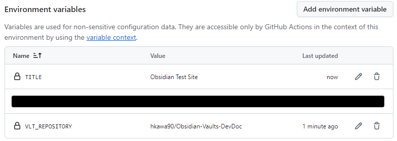

# Obsidianで作成したドキュメントを[Astro](https://astro.build/)の[Starlight](https://starlight.astro.build/) themeで公開する

Obsidianで作成していたMarkdownをsiteで公開できるようにテンプレートにしてみた。

- `Use this template`ボタン押下でSite(Github Pages)作成リポジトリができる
- [Astro](https://astro.build/)の[Starlight](https://starlight.astro.build/) themeで見栄えがいいSiteができる。

# Feature

- templateからリポジトリ作成して、別途用意した`Obsidian`のリポジトリからsiteをGitHub Pagesで公開できます。
- ローカルPCで`node.js`とかプログラムのインストールが不要です。
- GithubのEnvironmentにサイト情報を格納するようにしているため、ほほソースコードの編集作業などが不必要。
- deploy処理はGithub Actionsで実行するだけです。
- .github/workflow/deploy.yamlを実行するだけでObsidianのVaultsを格納した別リポジトリからサイトを構築できる。サイトでは`pagefind`で検索できるようになります。
- [HiDeoo/starlight-obsidian](https://github.com/HiDeoo/starlight-obsidian) plugin導入でほぼ`obsidian`と同様な表示となる。
	- Obsidianの再現性については[Features | Starlight Obsidian](https://starlight-obsidian.vercel.app/guides/features/)を参照。

# Demo

https://hkawa90.github.io/astro-starlight-obsidian-template/

# Getting Started

1. Gihubのアカウントを作成(`Sign up`)してログイン(`Sign in`)する。
2. こちらの上部にある`Use this template`をクリックして、

3. `Create a new repository`を選択
4. `Repository name`を入力して、`Create repository`をクリック

5. 新たなリポジトリが作成される。ここでページ上部の`Settings`をクリック

6. `Environments`をクリック

7. `New environments`をクリック

8. `Name`に`production`と入力して、`Configure environment`をクリック

9. ページ下部の`Envvironment variables`で`Add environment variable`をクリックして、3つの変数を作成します。
(1) `Name`に`VLT_REPOSITORY`を入力して、`Value`に`Obsidian`の`Github`リポジトリを指定します。リポジトリ名は`user-namename/repository-name`の形式で`ユーザ名`+`/`+`リポジトリ名`となります。
(2) `Name`に`TITLE`を入力して、`Value`にサイトのタイトルを入力します。
(3) `Name`に`VAULT`を入力して、`Value`に`MYVAULT`を入力します(将来的にはなくす方向)。


10. すべての変数を入力した状態です。


11. `Pages`を選択します。

12. `Build and deployment`項目の`branch`で`None`プルダウンから`main`を選択して、`Save`ボタンをクリック

13. ページ上部の`<> Code`を選択して、次に`.githbu/workflow/`、最後に`deploy.yml`を選択します。


14. ページ上部の`View Runs`を選択します。

15. `Run workflow`プルダウンメニューから`Run workflow`を選択。

16. 正常すると次のような画面となります。`Settings/Pages`ページ上部に公開されたURLが表示されます。`Visit site`をクリックすると作成されたページが確認できます。


# Requirement

- Obsidianの`vaults`のみをgithubに入れておいたもの。ここのリポジトリ名を控えておいてください。
- favicon.svg
  faviconファイルを`SVG`で用意しておきます。
- topページとなる`index.md`ないし`index.mdx`を用意しておきます。設定でObsidianのWelcomeページを利用することができます(後述)。

# Configuration

Githubの`Environment`で変数名を設定するだけです(実例はあとで追記予定)。
- 環境名productionの変数名 VLT_REPOSITORY
     リポジトリ名(owerner/repository形式)を設定する 例) hkawa90/Obsidian-sample-vaults
- 環境名productionの変数名 VAULT
      ObsidianのVault名を入力する
- 環境名productionの変数名 TITLE
	サイトのタイトルを入力します。

作成する`Site`のトップページを`Obsidian`のWelcomeページにする場合は、`astro.config.mjs`ファイルで

```js
// https://astro.build/config
export default defineConfig({
	site: siteName,
	base: baseName,
	// トップページをObsidianのWelcomeページへジャンプさせる場合は次の3行の先頭の//を削除する
	// redirects: {
	// 	'/': `/${baseName}/notes/welcome`
	// },
	integrations: [
		starlight({
			plugins: [
				// Generate the Obsidian vault pages.
				starlightObsidian({
					vault: vaultName,
				}),
			],
			title: titleName,
			// pagefindで日本語で検索できるようにするためlocaleを設定する
			locales: {
				root: {
					label: 'Japanese',
					lang: 'ja',
				},
			},
//			social: {
//				github: 'https://github.com/hkawa90/astro-starlight-trial',
//			},
			sidebar: [
				// Add the generated sidebar group to the sidebar.
				obsidianSidebarGroup,
			],
		}),
	],
});
```

次のように`//`(コメント)を削除してください。`notes/welcome`をほかのページのurlに変更すれば、それがトップぺーじになります。

```js
export default defineConfig({
	site: siteName,
	base: baseName,
	// トップページをObsidianのWelcomeページへジャンプさせる場合は次の3行の先頭の//を削除する
	redirects: {
	 	'/': `/${baseName}/notes/welcome`
	},
	integrations: [
```

